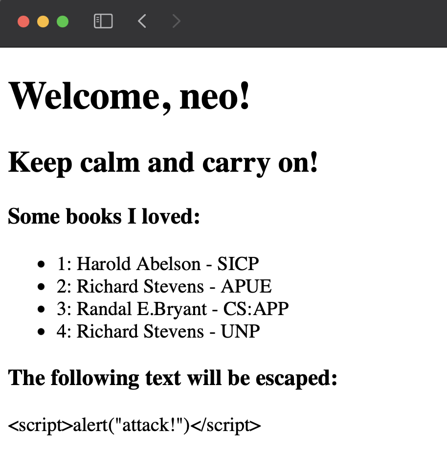

# A toy template engine

## Intro

It is a minimum template engine which contains two different implementation approaches: compile to Python function and compile to an AST.

## Features

* Loop and conditional logic

* Filters

* Dot notation for dict and list

* More...

## A quick example

This is a template:

```html
<!DOCTYPE html>
<html lang="en">
<head>
    <meta charset="UTF-8">
    <title>mini template</title>
</head>
<body>
    <h1>Welcome, {{ user.name }}!</h1>

    {# It' a comment text, and will not be rendered. #}

    
    <h2>{{ msg }}</h2>
    
    <h2>Writing a template is easy!</h2>
    

    <h3>Some books I loved: </h3>
    <ul>
    
        <li>
            <span>{{ loop.index }}: </span>
            <span>{{ book.author }} - {{ book.title }}</span>
        </li>
    
    </ul>

    <h3>The following text will be escaped:</h3>
    <div>{{ html_content | escape }}</div>
</body>
</html>
```

Let's render it:

```python3
from template_to_ast import Template

template = Template()
result = template.render(
    './example.html',
    user={'name': 'neo', 'locations': ['shanghai', 'hangzhou']},
    msg='Keep calm and carry on!',
    books=[
        {'author': 'Harold Abelson', 'title': 'SICP'},
        {'author': 'Richard Stevens', 'title': 'APUE'},
        {'author': 'Randal E.Bryant', 'title': 'CS:APP'},
        {'author': 'Richard Stevens', 'title': 'UNP'},
    ],
    html_content='<script>alert("attack!")</script>'
)
```

The result is:



## API

Haha~

## License

MIT
